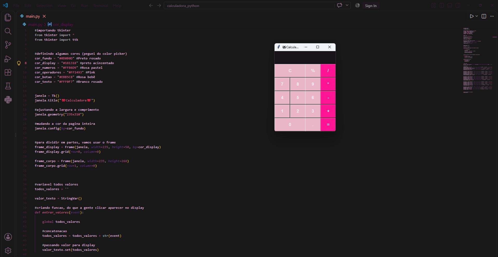

<div align="center">

# 🎀 Calculadora Python 🎀

Uma calculadora desktop simples, feita com **Python + Tkinter**, com um visual pastel/rosa personalizado do zero (sem bibliotecas de UI prontas).


</div>

---

## 📸 Preview

<div align="center">
  
</div>

> 🎥 **Demonstração em vídeo:**
https://github.com/user-attachments/assets/3c92f90e-76ae-4dd0-9162-757006481890

---

## ✨ Sobre o projeto

Este projeto foi desenvolvido para praticar lógica de programação e interface gráfica em Python, usando a biblioteca **Tkinter**. A proposta foi ir além do básico: em vez de usar os layouts padrões (`pack`/`grid` "cru"), o posicionamento dos elementos foi feito manualmente com `.place()`, e toda a paleta de cores foi escolhida a dedo em um color picker para criar uma identidade visual própria (tema rosa/pink 🎀).

A calculadora realiza as operações matemáticas básicas e foi construída sem frameworks externos — apenas Python puro e sua biblioteca gráfica nativa.

## 🚀 Funcionalidades

- ➕ Adição, ➖ Subtração, ✖️ Multiplicação, ➗ Divisão
- 🔢 resto da divisão (`%`)
- 🧮 Números decimais (`.`)
- 🧹 Botão de limpar tela (`C`)
- 🎨 Interface customizada com paleta de cores própria
- 🖱️ Interações via `command` e funções `lambda`

## 🛠️ Tecnologias utilizadas

- **[Python 3](https://www.python.org/)**
- **[Tkinter](https://docs.python.org/3/library/tkinter.html)** — biblioteca gráfica nativa do Python

## 🎨 Paleta de cores

| Cor | Hex | Uso |
|---|---|---|
| 🖤 Preto rosado | `#0D0B0D` | Fundo da janela |
| ⬛ Preto acinzentado | `#181318` | Fundo do display |
| 🩷 Rosa pastel | `#FFB6D9` | Números |
| 💗 Pink | `#FF1493` | Operadores |
| 🌸 Rosa bebê | `#EBB5C8` | Botões |
| 🤍 Branco rosado | `#FFF0F7` | Texto |

## ▶️ Como executar o projeto

**Pré-requisitos:** ter o [Python 3](https://www.python.org/downloads/) instalado (o Tkinter já vem incluso na instalação padrão do Python).

```bash
# Clone este repositório
git clone https://github.com/Vinicius-Alves-dev/calculadora-python.git

# Entre na pasta do projeto
cd calculadora-python

# Execute o arquivo principal
python main.py
```

> 💡 No Linux, pode ser necessário instalar o Tkinter separadamente:
> `sudo apt-get install python3-tk`

## 📁 Estrutura do projeto

```
📦 calculadora-python
 ┣ 📜 main.py          # Código principal da calculadora
 ┣ 📜 README.md         # Este arquivo
 ┗ 📁 assets            # Imagens e vídeo de demonstração
```

## 🧠 O que aprendi / próximos passos

- Manipulação de widgets do Tkinter com posicionamento absoluto (`.place()`)
- Uso de `StringVar()` para atualizar a interface em tempo real
- Boas práticas de organização de código com funções e variáveis globais

**Possíveis melhorias futuras:**
- [ ] Substituir `eval()` por um parser de expressões mais seguro
- [ ] Adicionar suporte a teclado (bind de teclas numéricas)
- [ ] Adicionar histórico de cálculos
- [ ] Empacotar em executável (.exe) com PyInstaller

## 📄 Licença

Este projeto está sob a licença MIT. Sinta-se livre para usar, estudar e modificar.

## 👩‍💻 Autor(a)

Feito com 🩷 por **José Vinicius Alves Oliveira Pereira**

[](https://www.linkedin.com/in/vinicius-alves-a57990416/)
[](https://github.com/Vinicius-Alves-dev)

